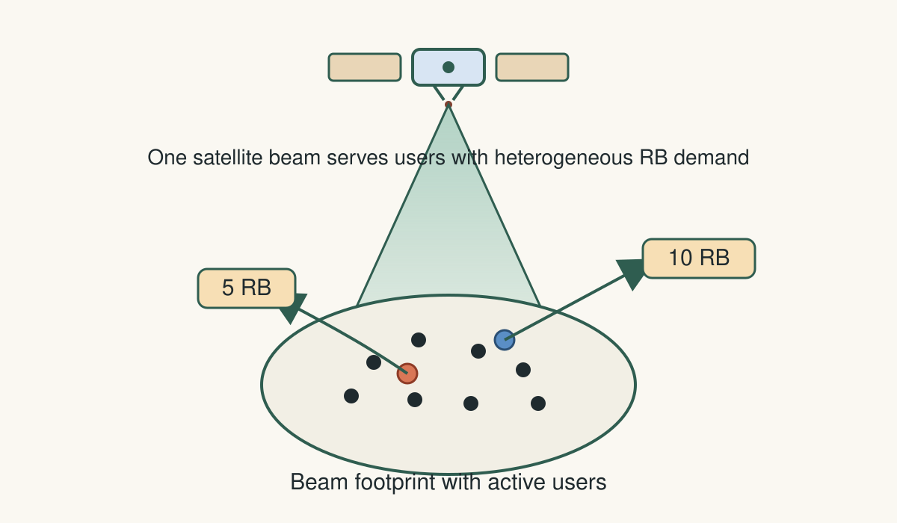
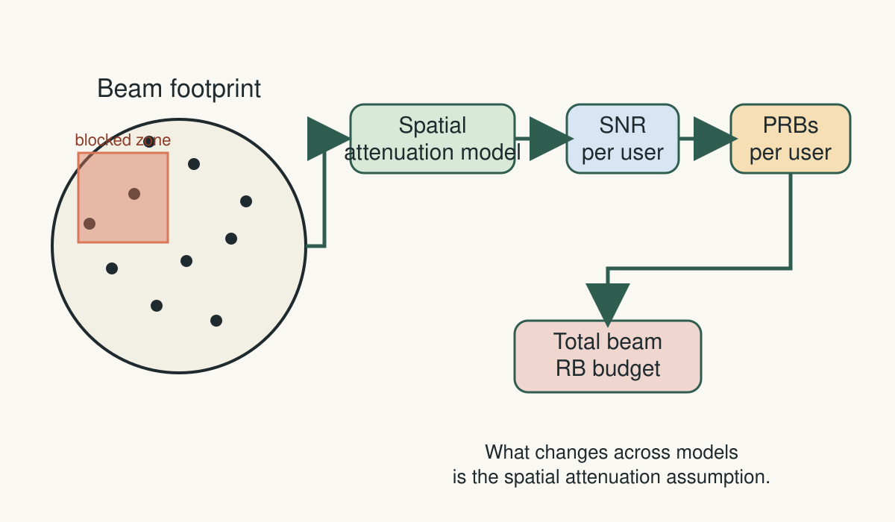
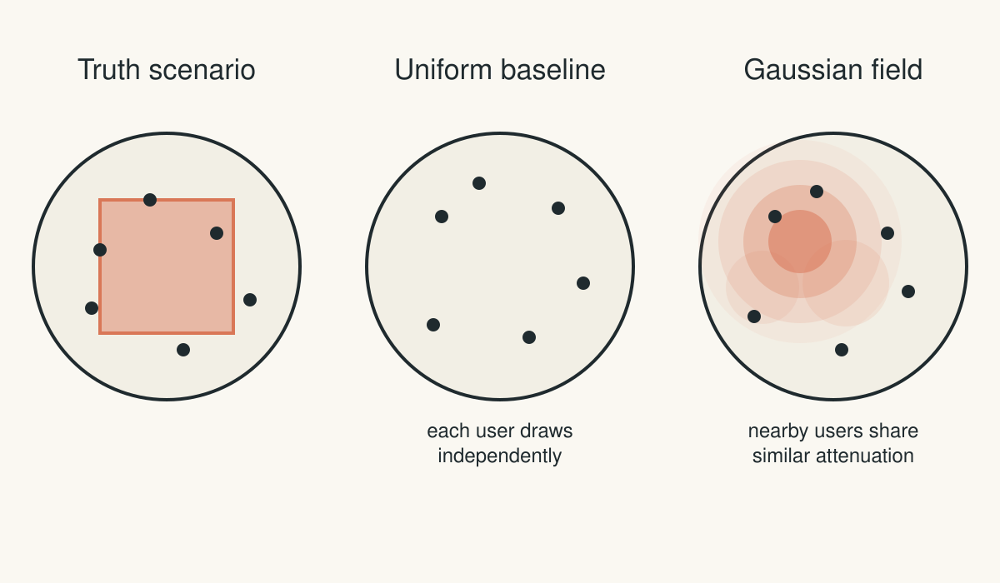
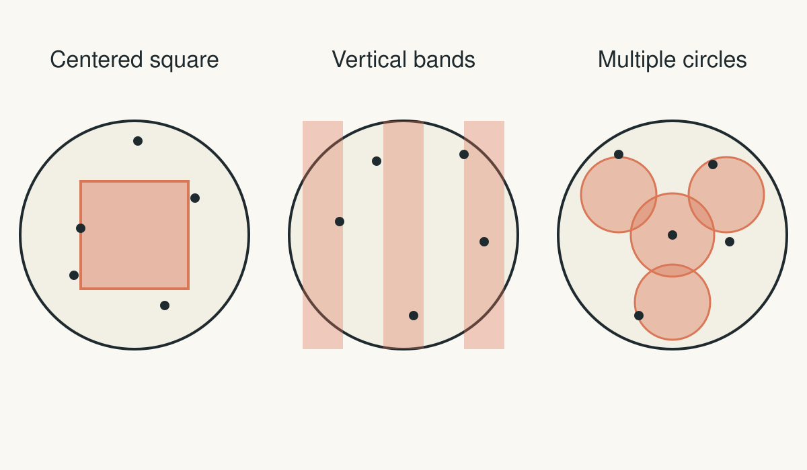
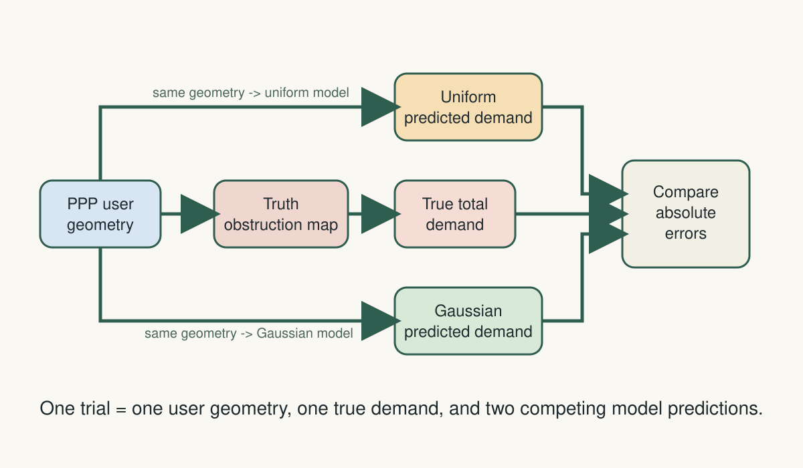

# Dimensioning Problem

- A resource block (RB) is a small time-frequency slice of spectrum allocated to a user by a scheduler for wireless communication.

- Dimensioning is a long-horizon planning task of choosing how many satellite resources to deploy

  - Choose the smallest RB-budget per beam that keeps outage probability below a target.

---

# Objective

- We test whether modeling spatial dependence, rather than only the marginal law, materially improves satellite RB-dimensioning decisions.

- We will define this formally in the coming slides

---

# Modeling Layer

- The operational decision is a **beam-level RB budget**
  - not a next-instant scheduler action.
- The object that matters is **aggregate demand across many users under one spatial attenuation pattern**.
- So the study keeps only the mechanisms that change that object:
  - user geometry
  - spatial attenuation
  - attenuation $\rightarrow$ SNR $\rightarrow$ RB demand
- Fine details are largely not relevant

---

# Formalising Objective: Fields

- $F_G$: one-point probability distribution of log-shadowing for a single user.
  - i.e. distribution of one log-shadowing value $G(x)$ at one location $x$
- $G_U$: iid baseline field, with independent user values and marginal law $F_G$.
  - The random field $G_U$ is a random function $x\mapsto G_U(x)$ (equivalently, a collection $\{G_U(x)\}_{x\in\mathcal{B}}$, where $\mathcal{B}$ is the beam footprint)
- $G_G$: Gaussian field, with correlated user values and the same marginal law $F_G$.
  - $G_G : x\mapsto G_G(x)$ (equivalently, a collection $\{G_G(x)\}_{x\in\mathcal{B}}$)
- $G^\star$: benchmark truth field with structured spatial geometry (may be non-Gaussian).
  - $G^\star : x\mapsto G^\star(x)$ (equivalently, a collection $\{G^\star(x)\}_{x\in\mathcal{B}}$)

---

# Formalising Objective: Gaussian Field

For realized users $X=\{x_i\}_{i=1}^{N}$:

- $G^\star$: benchmark truth field (reference for evaluation).
- $G_G$: Gaussian-candidate field (the model we test against truth).
- $Z$: latent Gaussian helper used only to construct $G_G$.

Construction of $G_G$:
$$
Z(X):=\bigl(Z(x_1),\dots,Z(x_N)\bigr)^\top\sim\mathcal{N}\!\bigl(0,K_\ell(X)\bigr),\qquad
\bigl[K_\ell(X)\bigr]_{ij}=\exp\!\left(-\frac{\|x_i-x_j\|^2}{2\ell^2}\right).
$$
- $\Phi$: standard normal CDF.
- $U_i:=\Phi(Z_i)$: percentile of user $i$ under the latent Gaussian draw.
$$
U_i=\Phi(Z_i),\qquad G_G(x_i)=F_G^{-1}(U_i).
$$

---

# Formalising Objective: Gaussian Field Interpretation

- Step 1 (dependence): draw the latent correlated Gaussian vector $Z(X)\sim\mathcal{N}(0,K_\ell(X))$.
- Step 2 (percentiles): for each user, convert latent value to a percentile
  $U_i=\Phi(Z_i)\in[0,1]$.
- Step 3 (target marginal): map percentile into log-shadowing
  $G_G(x_i)=F_G^{-1}(U_i)$.
- Meaning of $G_G(x_i)=F_G^{-1}(U_i)$: "take percentile $U_i$ and read off the corresponding quantile of $F_G$."
- Consequence:
  for each user $i$, $G_G(x_i)\sim F_G$,
  and cross-user dependence comes from $K_\ell$ through $Z(X)$.

---

# Formalising Objective: Demand Map

Conditional on a realized user geometry $X$, the demand map is
$$
G \mapsto D(X,G).
$$

In terms of resource blocks: for any user geometry $X$ and any shadowing field $G$,
$$
D(X,G)=\sum_{i=1}^{N} N_{\mathrm{RB}}(x_i;G)
$$
is the total beam demand, where $N_{\mathrm{RB}}(x_i;G)$ is computed from the required user bit rate $c$, per-RB bandwidth $W_{\mathrm{RB}}$ (a system parameter), and spectral efficiency $\eta(x_i;G)$ (achievable bits/s/Hz at location $x_i$ under field $G$).

$$
N_{\mathrm{RB}}(x_i;G)=\left\lceil\frac{c}{W_{\mathrm{RB}}\eta(x_i;G)}\right\rceil.
$$

---

# Formalising Objective: Model Specification

- $F_G$: fixed shared one-point marginal law (the same for all compared models).
- $\Theta_0$: set of Gaussian parameter values considered in the comparison.
- $\mathcal{M}_{\mathrm{cmp}}:=\{U\}\cup\{(G,\theta):\theta\in\Theta_0\}$: set of compared model specifications.
- $G_M$: field induced by compared model specification $M\in\mathcal{M}_{\mathrm{cmp}}$.
- $G^\star$: benchmark truth field, kept separate from $\mathcal{M}_{\mathrm{cmp}}$.

---

# Formalising Objective: Budget Output

For any compared model specification $M\in\mathcal{M}_{\mathrm{cmp}}$, the budget dimensioning output is
$$
\widehat{B}_M=\min\Bigl\{b\in\mathcal{G}_{\mathrm{RB}}:\widehat{\mathbb{P}}_n\bigl(D(X,G_M)>b\bigr)\le\varepsilon\Bigr\}.
$$

- Here $\mathcal{G}_{\mathrm{RB}}\subset\mathbb{N}$ is the tested grid of candidate beam RB budgets.
- $\varepsilon\in(0,1)$ is the target outage probability.
- $\widehat{\mathbb{P}}_n$ is the empirical outage frequency estimated from $n$ Monte Carlo trials.
- This is the model-side budget selection rule under model $M$.

---

# Formalising Objective: Decision Comparison

- Truth-side empirical evaluation uses $\widehat{\mathbb{P}}^\star_n\!\left(D(X,G^\star)>\widehat{B}_M\right)$.
- Benchmark truth budget:
$$
\widehat{B}^\star=\min\{b\in\mathcal{G}_{\mathrm{RB}}:\widehat{\mathbb{P}}^\star_n(D(X,G^\star)>b)\le\varepsilon\}.
$$
- Comparison criterion: $|\widehat{B}_{(G,\theta)}-\widehat{B}^\star|<|\widehat{B}_U-\widehat{B}^\star|$ for $\theta\in\Theta_0$.
- The target of interest is **the budget decision**. Pointwise recovery of $G(x)$ is secondary.

---

# Formal Objective

Define the model-side budget error against truth:
$$
\Delta_M:=|\widehat{B}_M-\widehat{B}^\star|,\quad M\in\mathcal{M}_{\mathrm{cmp}}.
$$

$$
\text{With geometry law }\mathcal{L}_X\ (\text{e.g. }X\sim\mathrm{PPP}(\lambda)\text{ on }\mathcal{B}),\ D(X,\cdot),\ F_G,\ \varepsilon,\ \mathcal{G}_{\mathrm{RB}}\ \text{fixed,}
$$
$$
\text{identify structured truth classes }\mathcal{C}\text{ for which }\exists\theta\in\Theta_0\text{ such that }
\Delta_{(G,\theta)}<\Delta_U\ \text{for }G^\star\in\mathcal{C}.
$$

- Here "fixed geometry" means the distribution $\mathcal{L}_X$ is fixed, not one single realized $X$.
- PPP example in this line: $X\sim\mathrm{PPP}(\lambda)$ on $\mathcal{B}$ means a homogeneous Poisson user process with constant intensity $\lambda$ over the footprint.
- In words: among structured non-Gaussian truth fields, when does replacing iid dependence with Gaussian dependence produce a beam budget closer to truth?

---

# No-Free-Lunch (NFL) Motivation for Objective

- Averaged uniformly over all possible problems $f:X\to Y$, no algorithm has a universal advantage
$$
\forall A,B,\quad
\frac{1}{|Y|^{|X|}}\sum_{f\in Y^X}\mathrm{Perf}(A,f,m)
=
\frac{1}{|Y|^{|X|}}\sum_{f\in Y^X}\mathrm{Perf}(B,f,m).
$$

- $X$: finite input/search domain.
- $Y$: finite output/value set.
- $Y^X:=\{f:X\to Y\}$: set of all objective mappings from $X$ to $Y$; one problem is one $f\in Y^X$.
- $A,B$: two optimization algorithms.
- $m$: evaluation budget (number of function queries/steps).
- $\mathrm{Perf}(A,f,m)$: performance of algorithm $A$ on problem $f$ after budget $m$.

---

# NFL in Our Context

- In our context: over all possible truth fields, Gaussian dependence cannot beat iid uniformly.
- So the question is meaningful only after defining a structured truth/search class $\mathcal{C}$.
- This motivates two steps:
  - first, restrict the objective to a structured truth class $\mathcal{C}$;
  - then enforce fair comparison under matched assumptions inside that class.

---

# Fair Comparison 

- Within each trial, the realized user geometry $X$ is the same for all compared models.
- Across trials, $X$ is resampled from the same fixed geometry law $\mathcal{L}_X$.
- The one-point marginal law $F_G$ is the same for all compared models.
- The pathloss convention and the demand map $G \mapsto D(X,G)$ are the same.
- The outage target $\varepsilon$ and budget grid $\mathcal{G}_{\mathrm{RB}}$ are the same.

So the comparison isolates one question:

$$
\text{which structured truth classes }\mathcal{C}\text{ admit a Gaussian advantage, i.e. }
\exists\theta\in\Theta_0\ \text{with }|\widehat{B}_{(G,\theta)}-\widehat{B}^\star|<|\widehat{B}_{U}-\widehat{B}^\star|?
$$

---

# Why Simulation Is Necessary

- The question is **comparative**: which approximation is better against a controlled truth?
- An analytic-first treatment would force us to choose a tractable truth family up front.
- That would risk baking the Gaussian answer into the setup.

The benchmark truth budget is
$$
\widehat{B}^\star=\min\Bigl\{b\in\mathcal{G}_{\mathrm{RB}}:\widehat{\mathbb{P}}^\star_n\bigl(D(X,G^\star)>b\bigr)\le\varepsilon\Bigr\}.
$$

- If $G^\star$ is already Gaussian by construction, the test is weak.
- So the truth family should be spatially structured, but not Gaussianized for convenience.

---

# Competing Surrogates (Recap)

---

# Competing Surrogates (Recap)

**iid baseline**
$$
G_U(x_i)\stackrel{\mathrm{iid}}{\sim}F_G.
$$

**Gaussian surrogate**
$$
Z(X)\sim\mathcal{N}\!\bigl(0,K_\ell(X)\bigr),
\qquad
\bigl[K_\ell(X)\bigr]_{ij}=\exp\!\left(-\frac{\|x_i-x_j\|^2}{2\ell^2}\right),
$$
$$
U_i=\Phi(Z_i),
\qquad
G_G(x_i)=F_G^{-1}(U_i).
$$

- Both surrogates share the same marginal $F_G$.
- $Z(X)$ is the latent Gaussian fluctuation over the realized users.
- $K_\ell(X)$ is the geometry-dependent covariance matrix, and $\ell$ is its physical correlation length.
- $U_i$ is the percentile assigned to user $i$ before mapping into the shadowing law $F_G$.

---

# Benchmark Truth Family

We use explicit obstruction sets $A_s\subset\mathcal{B}$ and define
$$
G^\star_s(x)=g_{\mathrm{clear}}+\Delta g\,\mathbf{1}_{A_s}(x),
\qquad
\Delta g<0.
$$

- $A_s$: blocked subset of the footprint for scenario $s$.
- $\mathbf{1}_{A_s}(x)$: indicator (equals $1$ if $x\in A_s$, else $0$).
- $g_{\mathrm{clear}}$: clear-sky log-shadowing level outside blocked regions.
- $\Delta g<0$: fixed attenuation penalty applied inside blocked regions.
- This isolates the effect of **spatial shape** rather than trivial changes in average loss.

Examples:

- one large blocked region
- strip-like blocked regions
- multiple separated blocked clusters

---

# Ground-Truth Scenario Geometry

- **Centered square:** one large contiguous blocked region
- **Vertical bands:** alternating strip-like structure
- **Multiple circles:** several  local blocked regions

---

# One Trial

1. Sample one PPP user geometry $X$ in the beam.
2. Evaluate the truth field $G^\star_s$ on those user locations.
3. Compute the true total demand $D(X,G^\star_s)$.
4. On that same geometry, draw the surrogate models.
5. Convert those draws to total demand and compare with truth.

The same realized geometry is fed to truth, iid, and Gaussian models.

Truth-side clarification: for the current benchmark family, $D(X,G^\star_s)$ is deterministic on a fixed trial geometry $X$; Monte Carlo enters truth budgets only through many independent PPP trials (resampling $X$).

---

# One Trial (Workflow)

---

# Randomness Structure

- **Outer randomness:** a new PPP geometry $X$ each trial.
- **Inner randomness:** conditional on a fixed $X$, the surrogate models still draw shadowing values.
- In the current truth family, once $X$ and the scenario $s$ are fixed, $G^\star_s$ is deterministic.

For model $M\in\{U,G\}$, the inner Monte Carlo predictor is
$$
\widehat{D}_M(X)=\frac{1}{L}\sum_{j=1}^{L} D\bigl(X,G_M^{(j)}\bigr).
$$

---

# Randomness Structure (Interpretation)

This separates:

- randomness of the world
- randomness of the model's prediction mechanism
- $j$ indexes repeated surrogate draws on the same fixed user geometry
- $\widehat{D}_M(X)$ is the model's predicted total beam demand on that geometry

---

# What We Measure

**Trial-level prediction error**
$$
e_M(X;s)=\bigl|D(X,G^\star_s)-\widehat{D}_M(X)\bigr|,
\qquad M\in\{U,G\}.
$$

**Budget-level decision output**
$$
\widehat{B}_M=\min\Bigl\{b\in\mathcal{G}_{\mathrm{RB}}:\widehat{\mathbb{P}}_n\bigl(D(X,G_M)>b\bigr)\le\varepsilon\Bigr\}.
$$

- Terminology reminder: $s$ indexes the truth scenario geometry; $\mathcal{G}_{\mathrm{RB}}$ is the discrete candidate beam-budget grid; $b$ is one tested budget value from that grid.
- Trial-level superiority and budget-level superiority are related, but they are not the same object.
- A model can improve demand prediction without immediately changing the selected budget on a coarse grid.

---

# Experimental Controls

- Beam radius: $10$
- PPP intensity: $\lambda=1$
- Expected users per trial: about $314$
- Per-user RB cap: $10$
- Trials per seed-scenario: $100$
- Inner prediction draws per trial: $10$
- Candidate budget grid: $500,1000,\dots,6000$
- Current Gaussian kernel family: RBF
- Current Gaussian spatial parameter: correlation length $\ell$

---

# Methodological Points

- The geometry family is simple on purpose
- The present goal is clean identification, not maximum realism; mixing up the level of modeling required would be counterproductive
- Monte Carlo is not magic! Search space must be carefully defined
- Pulling values used in literature for ITU-R / 3GPP specs to fix a specific instantiation of $F_G$ is not the most pressing issue - at best this will fix a single shadowing scenario. 
- Claiming that that is a general result would be incorrect.
---

# What This Methodology Gives Us

- A clean separation between **truth**, **surrogate**, and **decision map**
- A fair iid-vs-Gaussian comparison with the same marginal $F_G$
- A way to ask whether Gaussian dependence helps on some spatial geometries but not others
- A controlled benchmark before adding richer physics or harder calibration layers

This is the actual mathematical question:
$$
\text{for which truth families is } \widehat{B}_G \text{ closer to } \widehat{B}^\star \text{ than } \widehat{B}_U?
$$

---

# Methodological Message

- The aim is not to prove that Gaussian structure is always best.
- The aim is to characterize when a dependence-aware surrogate improves the decision we care about.
- The current deck is therefore about **experimental design and mathematical comparability**, not yet about final empirical claims.

This is a an attempt to create a coherent benchmark methodology.

---

# Channel Model Used

For any shadowing field $G$ and user location $x$:
$$
d(x)=\sqrt{h^2+r(x)^2},
\qquad
\mathrm{SNR}(x;G)=SNR_0\Bigl(\frac{d(x)}{h}\Bigr)^{-\gamma}e^{G(x)}.
$$

$$
\eta(x;G)=\max\!\bigl(\eta_{\min},\log_2(1+\mathrm{SNR}(x;G))\bigr).
$$

- $d(x)$: slant range from satellite to user.
- $\gamma$: pathloss exponent.
- $G(x)$: log-shadowing term (enters multiplicatively in linear SNR through $e^{G(x)}$).
- $\eta(x;G)$ then feeds RB demand via
  $N_{\mathrm{RB}}(x;G)=\left\lceil \frac{c}{W_{\mathrm{RB}}\eta(x;G)}\right\rceil$.

---

# Symbols I

### Geometry and Users

- $\mathcal{B}$: physical beam footprint in the user plane.
- $x$: physical location of one user in that footprint.
- $\lambda$: mean user density per unit area in the footprint.
- $N$: number of active users in one realized beam.
- $X=\{x_i\}_{i=1}^{N}$: realized set of user locations in that beam.
- $x_i$: physical location of user $i$.
- $s$: index labeling one obstruction geometry.
- $A_s$: physically blocked region for scenario $s$.

---

# Symbols II

### Channel and Demand

- $F_G$: one-point probability distribution of log-shadowing for a single user.
- $G_0$: generic one-user log-shadowing value drawn from $F_G$.
- $G$: generic shadowing field over the whole beam.
- $d(x)$: slant range from the satellite to location $x$.
- $h$: satellite altitude above beam center.
- $r(x)$: ground-plane offset of location $x$ from beam center.
- $SNR_0$: reference clear-sky SNR at the reference distance.
- $\gamma$: pathloss exponent in the deterministic propagation law.
- $\mathrm{SNR}(x;G)$: SNR of the user at location $x$ under shadowing field $G$.
- $\eta(x;G)$: spectral efficiency available to that user under field $G$.
- $\eta_{\min}$: minimum spectral-efficiency floor imposed by the model.
- $c$: required user bit rate.
- $W_{\mathrm{RB}}$: bandwidth of one resource block.
- $N_{\mathrm{RB}}(x;G)$: RB demand of the user at location $x$ under field $G$.
- $D(X,G)$: total beam RB demand for user geometry $X$ under field $G$.
- $g_{\mathrm{clear}}$: clear-sky log-shadowing level outside blocked regions.
- $\Delta g$: additional attenuation penalty inside a blocked region.

---

# Symbols III

### Models and Outputs

- $\Theta_0$: set of Gaussian parameter values considered in the comparison.
- $\mathcal{M}_{\mathrm{cmp}}:=\{U\}\cup\{(G,\theta):\theta\in\Theta_0\}$: set of compared model specifications.
- $M\in\mathcal{M}_{\mathrm{cmp}}$: one compared model specification, e.g. $U$ or $(G,\theta)$.
- $G_M$: shadowing field produced by model $M$.
- $G_U$: iid baseline shadowing field.
- $G_G$: correlated Gaussian surrogate shadowing field.
- $G^\star$: benchmark truth shadowing field.
- $G^\star_s$: benchmark truth shadowing field for scenario $s$.
- $Z(X)$: latent Gaussian vector used to couple nearby users spatially.
- $U_i$: percentile assigned to user $i$ by the latent Gaussian draw.
- $K_\ell(X)$: covariance matrix induced by the user geometry.
- $\ell$: physical correlation length in the Gaussian surrogate.
- $\Phi$: standard normal CDF used to map Gaussian draws into marginal percentiles.
- $L$: number of inner Monte Carlo draws on one fixed user geometry.
- $j$: index of one inner Monte Carlo draw on that fixed geometry.
- $\widehat{D}_M(X)$: Monte Carlo predictor of total beam demand under model $M$.
- $e_M(X;s)$: trial-level absolute demand error under model $M$ in scenario $s$.
- $\varepsilon$: target overload or outage probability.
- $\mathcal{G}_{\mathrm{RB}}$: tested grid of beam RB budgets.
- $b$: one candidate beam RB budget from that grid.
- $\widehat{B}_U,\widehat{B}_G,\widehat{B}^\star$: empirical budgets selected under the iid, Gaussian, and truth models.
- $\widehat{B}_M$: empirical budget selected by model $M$.
