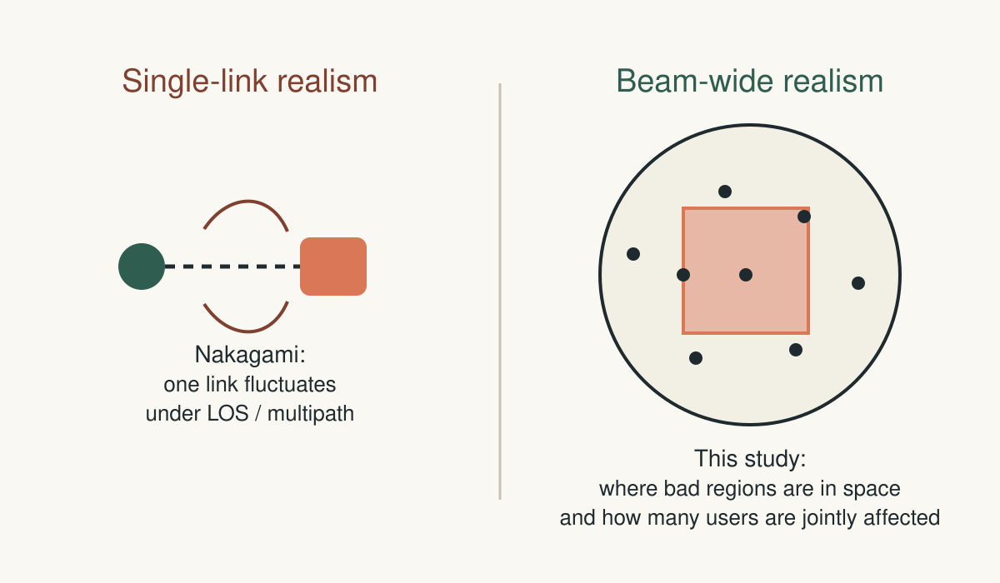

# Motivation

- We are dimensioning the long-term number of satellites needed
  - Not making a next-instant scheduling decision
- That requires a beam-level model for Resource Block (RB) demand under spatially structured attenuation
- No such model exists in the literature. Operators compensate with over capacity. 
  - Not feasible long term as userbase explodes (planes etc).

- Is a Gaussian spatial model accurate enough for the beam-level demand estimation problem?

<!--
Opening motivation slide added before the title so the audience sees the
practical problem first.

Use this slide to establish:
- there is a real long-horizon dimensioning decision;
- that decision depends on the beam-level attenuation model;
- the study exists to test whether a Gaussian approximation is good enough for that planning problem.
-->

---

# Governing Principles

- A model should be judged against the question it is built to answer
- This study lives at the **beam-level RB-dimensioning** layer
- Wrong-layer detail is **confounding detail**, not rigor.

<!--
Use this slide as the governing rule for the whole talk.

Whenever someone asks for extra realism, bring them back here:
- what is the question?
- what abstraction level answers it?
- does the proposed detail sharpen inference or confound it?
-->

---

# Testing Shadowing Models
## for Satellite RB Dimensioning

- Spatial attenuation model -> SNR -> PRBs per user -> total beam RB budget
- Goal: decide whether a **Gaussian field** is a better RB-dimensioning model than an **iid uniform baseline**
- Method: compare both models against explicit obstruction scenarios

<!--
Original slide material preserved from outline slides 1 and related notes.
Main message:
This work asks whether a Gaussian spatial model is good enough for RB dimensioning under spatially structured attenuation.

Longer points:
- A shadowing model tells us how attenuation is distributed across users in the beam.
- That attenuation is turned into user SNR, then into PRBs needed per user, then into a total RB budget for the beam.
- Context: satellite systems must choose enough resource blocks to meet demand without wasting capacity.

Speaker notes:
The audience needs the full chain immediately:
- the model describes spatial attenuation across users;
- attenuation determines SNR;
- SNR determines PRBs per user;
- summing across users gives the RB budget recommendation.
That makes the role of the model concrete on slide 1.
-->

---

# What Is the Channel Model Here?

- This is a **beam-level** model for one decision: RB dimensioning
- It keeps only what changes that decision: user positions, spatial attenuation, and demand mapping
- Lower-layer physical-layer (PHY) radio detail is deliberately out of scope for this study

<!--
Source: outline slide 2.
Original content preserved:
In a full telecom stack, one link may include many effects:
- geometry and link budget;
- pathloss;
- shadowing / attenuation;
- small-scale fading;
- coding, modulation, scheduler details, and many other implementation effects.

This study deliberately keeps only the pieces needed for the question we are asking:
- users are placed spatially in the beam;
- users experience location-dependent attenuation;
- attenuation changes SNR;
- SNR determines PRBs needed;
- total beam demand is aggregated across users.

What we keep:
- the spatial layout of users;
- the spatial layout of attenuation;
- the mapping from attenuation to demand.

What we deliberately leave out:
- extra realism that does not help answer the present question more clearly.
- any individual-user-equipment fading model that operates at a different level of abstraction from the beam-level dimensioning problem.

Speaker notes:
A model should be designed for the question it is built to answer; we need to find the right abstraction and drop unnecessary detail.

We are not claiming this is the most realistic end-to-end channel model. We are claiming it is the right abstraction for isolating the effect of spatial attenuation structure on beam-wide RB dimensioning.
For the realism-focused audience member, say explicitly:
- yes, more realism is possible;
- no, that is not automatically better for this study;
- adding realism that changes many mechanisms at once makes it harder to tell whether the Gaussian spatial assumption is helping or hurting.
- hyper-perfectionist realism is a risk here because it can muddy the causal question instead of sharpening it.
- this project is not going down to individual-user-equipment fading models; that is outside the scope of the work and outside the decision level being studied.
-->

---

# Full Reality vs This Study

| Full telecom reality | Our Channel Model |
|---|---|
| Many interacting mechanisms at once | Only the mechanisms needed for the study question |
| Link-level and implementation-level detail | Beam-level demand abstraction |
| Geometry, pathloss, shadowing, fading, coding, scheduler, implementation effects | User positions, spatial attenuation, attenuation -> SNR -> PRBs -> total demand |
| Harder to isolate one cause | Built to isolate the effect of spatial attenuation structure |
| Useful for end-to-end realism | Useful for testing the Gaussian spatial assumption cleanly |

<!--
This slide helps the audience orient to the abstraction gap before the stronger
scope-boundary slide that follows.
-->

---

# Disciplined Scope: What We Should Refuse To Mix

- Beam-level RB dimensioning belongs in this study
- Single-link fading, scheduler detail, and physical-layer radio realism do **not**
- We should not add unnecessary detail 
  - just to satisfy a reviewer

<!--
Table replacement for the earlier bubble diagram.
Use this slide to say:
- the two columns are not competing on "which is more realistic?";
- they answer different questions;
- this study is purpose-built for the beam-level spatial-dimensioning question.
-->

---

# What Nakagami Models

- **Nakagami** is a probabilistic model for how the received amplitude of one radio link fluctuates
- It is commonly used to represent different severities of line-of-sight or multipath fading on that one link
- So it belongs to the **single-link fading** layer of modeling

<!--
This slide gives the fair definition first, before the exclusion argument on the
next slide.
-->

---

# Why Not Just Use Nakagami?

- **Nakagami** is a single-link fading model
- This study is about **beam-wide spatial attenuation**, not single-link fading
- Adding Nakagami here would create a different study and make this one harder to interpret
- A bit like using quantum physics to model football
- Same deal with ephemerides, 3D, etc - not needed

<!--
Source: outline slide 3.
Original content preserved:
That is a legitimate realism choice for a different study.
But here the main question is:
- if attenuation has spatial structure across the beam, does a Gaussian field approximation produce a better RB-dimensioning model than a simple iid baseline?

To answer that, we need to know:
- whether many users are jointly sitting in a bad region;
- whether the loss geometry is one large zone or many small clusters;
- whether nearby users share similar attenuation;
- how those spatial patterns change total beam demand.

Nakagami by itself does not specify that spatial structure.

So the right framing is:
- Nakagami belongs to a different modeling level;
- this project is not working at the individual-user-equipment fading level at all;
- bringing it in would move the work away from the beam-level spatial dimensioning question we are actually studying.
- Why it is not the right model here: our study is not about fluctuations of one link; it is about how attenuation is arranged across many users in the beam, because RB dimensioning depends on the joint spatial demand created by all users together.
- Second rebuttal: even if every user had a Nakagami link, we would still need a separate spatial attenuation model to say which users are jointly in blocked regions and how that changes total beam demand.

Speaker notes:
"Realism is only useful when it is realism in the mechanism under test."
If someone asks why Nakagami is not used, the answer is:
- because Nakagami adds realism in single-link fading;
- this study is about realism in spatial attenuation structure;
- those are not the same thing.
If needed, say explicitly:
- this project does not go down to the individual-user-equipment fading level;
- that is not a missing detail here, it is a different study altogether.
If a stronger sentence is needed in the room, use:
"Adding every realistic detail is not rigor. If the added detail does not help answer the question under test, it is just another way to blur the result."
-->

---

# Single-Link vs Beam-Wide Realism

<!--
Split-out diagram from the Nakagami slide so the visual has enough room in Marp.
Use this slide to say:
- Nakagami is about one link;
- this study is about many users under a spatial attenuation map;
- the beam-wide spatial structure is the realism axis that matters here.
-->

---

# Why This Work Exists

- Long-term satellite dimensioning depends on beam-level RB demand estimates under uncertain spatial attenuation
- Underestimating demand risks too few satellites; overestimating it wastes scarce capacity
- Spatial structure changes that demand estimate, so the attenuation model matters

<!--
Source: outline slide 4.
Original content preserved:
- Satellite systems must choose an RB budget before knowing the exact user geometry and attenuation pattern of a given instant.
- If the budget is too small, users experience overload and poor service.
- If the budget is too large, scarce satellite resources are wasted.
- Shadowing is spatial: nearby users often experience similar attenuation.
- So the dimensioning result depends on the spatial model, not just on average loss.

Speaker notes:
Now that the audience knows the modeling level, this slide can make the case for existence cleanly. Start from the practical decision problem: "how many RBs do we need?" Then explain that spatial structure changes that answer.
-->

---

# The Gap

- **Uniform baseline:** simple, iid, ignores spatial structure
- **Gaussian field:** adds correlation
- Research question: **does the Gaussian assumption actually improve the dimensioning decision through better RB demand prediction?**

<!--
Source: outline slide 5.
Original content preserved:
- A simple baseline treats each user's shadowing independently.
- That ignores the fact that real attenuation often comes in spatial patterns: blocked regions, bands, and clusters.
- A Gaussian field model is a natural next step because it introduces spatial correlation.
- But correlation alone is not enough: we need to know whether it actually improves dimensioning decisions.

Speaker notes:
The audience should leave this slide knowing the exact scientific gap: "Does the Gaussian-field assumption improve the decision we care about?"
-->

---

# Why Simulation Is Necessary

- The question is comparative: which approximation is better against a controlled truth
- Only simulation lets us impose arbitrary obstruction geometries as truth without first forcing them into one tractable analytic family
- An analytic-first treatment would have to choose a tractable spatial shadowing law up front, which would also restrict the obstruction geometries we could represent cleanly within that treatment
  - e.g. a smooth stationary Gaussian field does not natively encode a hard-edged blocked square or alternating vertical strips as the truth model

<!--
Source: outline slides 6 and 7.
Original content preserved:
- We are not asking for the performance of one assumed model.
- We are asking whether one approximation is better than another when the true attenuation pattern has spatial structure.
- If we started from one closed-form model and solved everything analytically, we would already be assuming the answer.
- Simulation lets us define controlled truth scenarios that are not forced to be uniform or Gaussian.
- Then we can test both candidate models against the same truth.

Example preserved:
- suppose the true attenuation pattern is a large blocked square in the middle of the beam;
- now compare two approximations on that same truth:
  - iid uniform shadowing per user;
  - correlated Gaussian field shadowing.
- if we began by assuming a Gaussian field analytically, then the Gaussian assumption would already be built into the setup.
- simulation avoids that circularity: it lets us define the square-obstruction truth first, then ask which approximation is closer.

What simulation gives us that a closed-form model does not:
- A truth model with explicit spatial obstruction geometry.
- The same PPP user geometry fed to all compared models.
- A direct way to measure prediction error and dimensioning error.
- A controlled way to see where Gaussian structure helps and where it fails.

Speaker notes:
Simulation is not being used because analysis is impossible or because we want pretty plots. It is used because the scientific question is about model mismatch: we need a known truth pattern, then we need to ask which approximation makes the better dimensioning decision against that truth.
-->

---

# What Simulation Gives Us

- We can specify the truth first: squares, strips, or circles, or amorphous clouds or other atmospheric phenomena
- We can run both candidate models on the **same** PPP user geometry
- We can measure prediction error and dimensioning error on equal footing

<!--
This slide is the practical complement to the previous one.

The argument is:
- first explain why analytic-first is circular for this study;
- then explain what simulation uniquely gives us as a controlled experiment.
-->

---

# Research Questions

1. Is a Gaussian field better than an iid uniform baseline for predicting demand and dimensioning RB budgets?
2. Does the answer depend on the **shape** of the attenuation pattern?
3. Which obstruction patterns are captured well by a Gaussian field, and which are not?

<!--
Source: outline slide 8.
Speaker notes preserved:
This keeps the story tight. It also stops the audience from thinking the goal is "prove Gaussian is always best." That is not what the current results say.
-->

---

# What We Compare

- **Truth model:** explicit obstruction scenarios inside a circular beam
- **Uniform baseline:** independent log-shadowing draws per user
- **Gaussian model:** correlated Gaussian log-shadowing field

<!--
Source: outline slide 9.
Original content preserved:
- Truth model: deterministic obstruction scenarios placed inside a circular beam.
- Uniform baseline: each user gets an independent log-shadowing draw from a fixed interval.
- Gaussian model: users see a correlated Gaussian log-shadowing field.

Why this matters:
- the truth model defines what actually happens in the experiment;
- the uniform and Gaussian models are competing approximations.

Speaker notes:
This slide is important because many people confuse the Gaussian model with the truth model. Make it explicit: Gaussian is not "the answer"; it is one of the candidate approximations being tested.
-->

---

# Ground-Truth Obstruction Scenarios

- **Centered square:** one large blocked region
- **Vertical bands:** strip-like blocked regions
- **Multiple circles:** several separated blocked clusters

<!--
Source: outline slide 13.
Speaker notes preserved:
This slide sets up the most important result later: Gaussian does not behave the same way on all scenario types.
-->

---

# Obstruction Scenario Geometry

<!--
Split-out diagram from the obstruction-scenarios slide so the geometry picture
has enough room in Marp. Use this slide to point to the difference between one
large contiguous blocked region, banded structure, and clustered local blocks.
-->

---

# One Trial, Part 1

1. Sample PPP user positions in the circular beam
2. Evaluate the chosen obstruction scenario on those user positions
3. Convert shadowing to per-user PRB demand

<!--
Source: outline slide 10.
Speaker notes preserved:
One trial means one realized user geometry and one realized truth-side demand. Keep it procedural.
-->

---

# One Trial, Part 2

4. Sum to get the **true total demand** for that instant
5. Ask the uniform and Gaussian models what they would predict on that same geometry
6. Compare prediction errors

<!--
Split from the previous slide so the procedure stays readable in live delivery.
-->

---

# One Trial as a Workflow

<!--
Split-out diagram from the one-trial slide so the visual has enough room in Marp.
Use this slide to walk left-to-right through:
- PPP geometry;
- truth obstruction;
- model predictions;
- true total demand;
- error comparison.
-->

---

# Where the Randomness Comes From

- **Outer randomness:** a new PPP user geometry each trial
- **Inner randomness:** on one fixed geometry, the uniform and Gaussian models still draw random shadowing values
- In the current truth model, the obstruction pattern is deterministic once geometry is fixed

<!--
Source: outline slide 11.
Original content preserved:
This is why we use repeated inner prediction draws on one fixed geometry.

Speaker notes:
This slide is essential because this was the main source of confusion earlier.
Explain it slowly:
- outer loop = new world;
- inner loop = repeated model guesses for the same world.
-->

---

# What an Inner Prediction Draw Means

- On one fixed PPP geometry, draw the **uniform** model multiple times
- On that same geometry, draw the **Gaussian** model multiple times
- Average each model's total demand and compare those averages to the one true realized demand

<!--
Source: outline slide 12.
Speaker notes preserved:
This is the plain-language explanation of the Monte Carlo procedure. The goal is not to overwhelm the audience with statistics. The goal is to make it clear that the model is being evaluated on repeated guesses for the same fixed geometry.
-->

---

# Tentative Study Scale

- Beam radius: **10** units -> beam area **about 314** units
  - 1 unit can be anything where light speed is not very relevant
  - e.g. 5 nanometer, 2.5 metre, 1 kilometer, etc
- PPP intensity: **1 user per unit area** -> **about 314 expected users per trial**
- PRB cap per user: **10**

<!--
Split from the old example-setup slide so scale and Monte Carlo settings do not
fight for space.
-->

---

# Tentative Monte Carlo Setup

- **10** seeds and **100** trials per seed-scenario
- **10** inner prediction draws per trial
- Budget grid **500 to 6000** and **3000** pooled trial-level comparisons

<!--
Source: outline slide 14.
Original content preserved:
- Seeds: 10
- Trials per seed-scenario: 100
- Inner prediction draws per trial: 10
- 3 scenarios x 10 seeds x 100 trials = 3000 comparisons

Speaker notes:
This is where you reassure the audience that the study is not just a toy. Several hundred users per trial is already meaningful, and the setup is explicit enough to be reproducible.
-->

---

# What We Measure: Two Different Objects

- **Budget-level output:** overload frequency over the RB grid, then the smallest budget meeting target outage
- **Trial-level certificate:** on each trial, ask whether Gaussian predicts total demand more accurately than uniform
- **Stored outputs:** aggregate summaries in **`result_summary.txt`**, raw rows in **`result_table.txt`**

<!--
Source: outline slide 15.
Speaker notes preserved:
This is where you prevent a second common confusion: required-budget results and per-trial prediction certificates are related, but they are not the same object.
Current file mapping:
- `result_summary.txt` = pooled certificate + per-scenario summaries
- `result_table.txt` = raw trial rows + raw seed-level dimensioning rows
- old `results.txt` is obsolete and should not be used for cross-checking
-->

---

# Trial-Level Object: Certificate / Prediction Results on the Example

| Scenario | Gaussian better rate | Certified? | Uniform mean abs. error | Gaussian mean abs. error |
|---|---:|---:|---:|---:|
| Square center | 0.999 | Yes | 678.54 | 591.09 |
| Vertical bands | 0.999 | Yes | 682.18 | 594.73 |
| Multi circles | 0.001 | No | 133.96 | 221.40 |

**Pooled:** 1999 / 3000 successes, success probability 0.6663, lower bound 0.6440, certified = Yes

- Treat this as a **tentative diagnostic result**, not a final model ranking
- The extreme scenario-by-scenario outcomes may indicate either bugs or that the current scenarios are not yet well designed to differentiate the models cleanly
- Source: **`result_summary.txt`**

<!--
Source: outline slide 16.
Speaker notes preserved:
Do not overclaim from this slide.

Safer live wording:
- the pooled result is interesting, but it is not yet the main claim;
- the scenario breakdown currently looks too extreme;
- that can happen either because there is still a bug somewhere or because the current obstruction scenarios are not yet giving a good differentiating test of the models.

So the correct takeaway is not yet:
- "Gaussian wins here and fails there."

The correct takeaway is:
- "the framework is now revealing where the comparison is unstable, and that tells us what must be improved next."
-->

---

# Budget-Level Object: Tentative Dimensioning Summary

| Scenario | True required budget (median over 10 seeds) | Gaussian chosen budget (median) | Uniform chosen budget (median) |
|---|---:|---:|---:|
| Square center | 2000 | 1000 | 1000 |
| Vertical bands | 1500 | 1000 | 1000 |
| Multi circles | 1000 | 1000 | 1000 |

- Under the current tentative budget grid, the budget-level outputs are much coarser than the trial-level certificate outputs
- In this setup, the Gaussian advantage appears clearly in prediction accuracy before it appears in chosen budget
- Source: medians computed from the seed-level rows in **`result_table.txt`**

<!--
This is the separate budget-level object and should not be mixed with the
certificate table above.

These numbers were computed as seed-level truth-anchored repeated-trial
dimensioning summaries over the 10 standard tentative seeds, then summarized
by median required budget per scenario.

Computed summary:
- square_center: truth median 2000, uniform median 1000, gaussian median 1000
- vertical_bands: truth median 1500, uniform median 1000, gaussian median 1000
- multi_circles: truth median 1000, uniform median 1000, gaussian median 1000

Interpretation:
- the current budget grid is coarse;
- with this tentative setup, chosen budgets do not yet separate uniform and
  Gaussian, even though the trial-level prediction certificate does;
- that is not a contradiction, it is a difference between the two statistical
  objects.
-->

---

# Interpretation

- The current tentative result is **not** a finished claim about Gaussian dimensioning
- The present value is methodological: the framework can now test explicit obstruction patterns against competing models
- The main issue is geometry-dependent sign reversal while the budget-level outputs remain only weakly separated

<!--
Source: outline slides 17, 18, and 19.
Original content preserved:
What is new here:
- A clear truth-vs-model comparison setup.
- Explicit spatial obstruction scenarios.
- A repeated-trial RB-dimensioning pipeline.
- A trial-level statistical certificate comparing Gaussian and uniform.
- Reproducible tentative tests with structured outputs.

Why it matters:
- Satellite RB dimensioning depends on uncertainty in spatial attenuation.
- Simple baselines may miss important spatial structure.
- More expressive models are only useful if they improve the actual decision.
- This work provides an evidence-based way to decide when a Gaussian spatial model is worth using.

Speaker notes:
Back off cleanly here. The audience should not leave thinking we already have a polished final result.

Safer live wording:
- the current numerical results are tentative;
- the real value right now is that we now have a way to test spatial-model assumptions against explicit obstruction patterns;
- the current winner-takes-all outcomes are useful mainly because they tell us the framework still needs work;
- the correct response is not to add more realism;
- the correct response is to keep the basic scenario family fixed, resolve calibration and bug issues, and then see whether the opposite outcomes remain;
- if they remain, that is exactly the scientific phenomenon we should study.

End by returning to the disciplined study design rather than to a strong model-ranking claim.
-->

---

# What We Hold Fixed For Now

- **Squares, vertical strips, and circles are enough** for now
- We should **not** add more scenario realism until the calibration and bug questions are resolved
- The immediate job is to explain the opposite outcomes, not to bury them under more detail

<!--
This slide makes the scope decision explicit: hold geometry fixed, debug first.
-->

---

# Next Steps: Validation First

- First priority: confirm the current pipeline is bug free and statistically coherent
- Keep the current scenario family fixed until that validation is complete
- No richer realism before the current regime is trusted

<!--
Source: outline slide 20.
Speaker notes preserved:
This slide should repeatedly communicate that the work is far from finished.
-->

---

# Next Steps: Modeling After Validation

- The blockage law is still preliminary: it is a constant dB penalty inside blocked regions
- Broader geometry design, Gaussian parameter sweeps, and larger user scales come later
- None of that should start until the current regime is trusted

<!--
Use this slide to push back on premature realism and premature scaling.
-->

---

# If the Contrast Persists

- Resolve the calibration / bug issue behind the opposite outcomes first
- If the opposite outcomes survive validation, make them the scientific target itself
- In that case, the current simple geometry family is not a weakness; it is the right controlled setting

<!--
Suggested spoken closing:
"The path forward is not to overclaim from a tentative first run. The path
forward is to keep the scenario family fixed, remove bugs, fix calibration, and
then see whether the opposite outcomes remain. If they do, that is exactly
what we need to study."
-->

---

# One-Sentence Summary

Built a reproducible experiment for comparing spatial attenuation models, and the immediate task is to validate the pipeline under fixed simple geometry and attenuation assumptions; if the current opposite outcomes persist after that, they become the scientific phenomenon to study.

<!--
Source: backup slide from the outline.
-->
